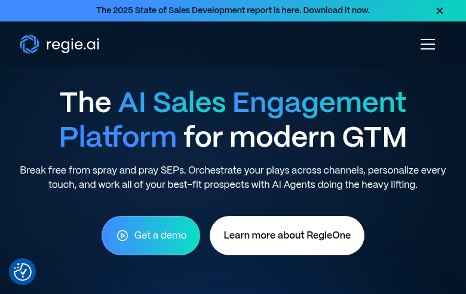
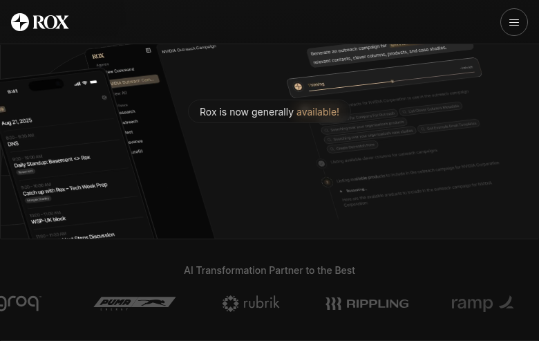
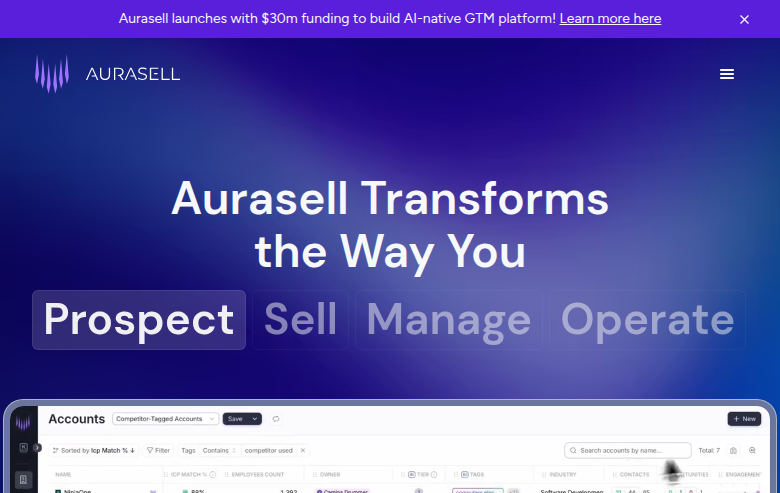
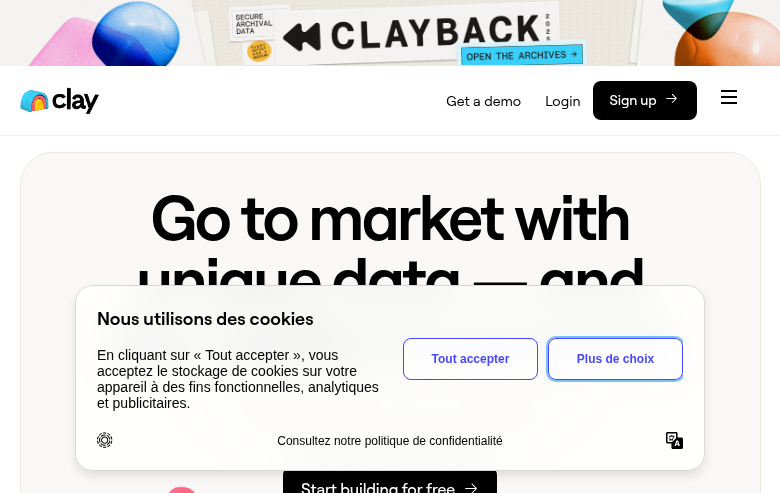
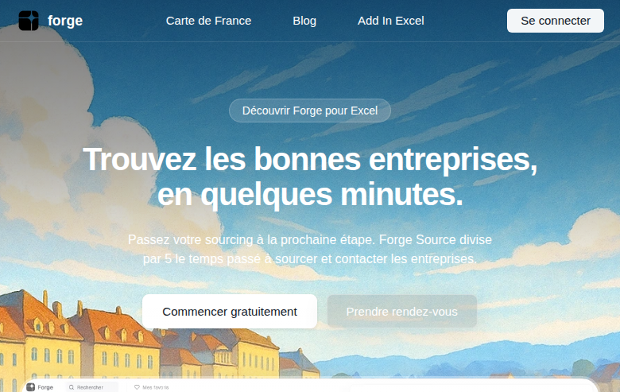

# Concurrents Otomata

## AI SDR Platforms

### 11x.ai
- **Site**: https://www.11x.ai
- **Produits**: Alice (email/LinkedIn), Julian (phone)
- **Funding**: $350M valuation, Série B $50M (a16z)
- **ARR**: ~$10M
- **Clients**: Leica, Checkr, Ouster, Rho

---

### Artisan (Ava)
- **Site**: https://www.artisan.co
- **Produit**: Ava - AI BDR
- **Funding**: $39.3M (Série A $25M)
- **Base**: 300M+ contacts
- **Approche**: All-in-one (data + warmup + outreach)

---

### Regie.ai
- **Site**: https://www.regie.ai
- **Produit**: AI Sales Engagement Platform
- **Pricing**: $35K+/an
- **Position**: #1 AI Sales Assistant G2 2024
- **Cible**: Remplace Outreach, SalesLoft

---

### Rox.ai
- **Site**: https://www.rox.ai
- **Produit**: AI Sales Platform

---

### AuraSell
- **Site**: https://aurasell.ai
- **Produit**: AI SDR automation

---

## Data Enrichment & Intelligence

### Harmonic.ai
- **Site**: https://harmonic.ai
- **Funding**: $30M raised
- **Base**: 20M+ companies, 150M+ profiles
- **Focus**: VCs et startup ecosystem
- **Clients**: a16z, Accel, Brex, Notion

---

### Clay
- **Site**: https://clay.com
- **Funding**: $1.25B valuation (Série B $40M)
- **Growth**: 6x en 2024
- **Base**: 150+ data sources, waterfall approach
- **Clients**: OpenAI, Canva, Rippling

---

### Phacet Labs
- **Site**: https://phacetlabs.com
- **Produit**: Data enrichment

---

### Forge
- **Site**: https://forgesolution.fr
- **Produit**: Sourcing M&A, données entreprises FR
- **Pricing**: 120€/mois (premium)
- **Focus**: Cabinets M&A, Search Funds, PE

---

### Amplemarket
- **Site**: https://amplemarket.com
- **Produit**: AI-powered sales platform
- **Features**: Data + engagement + intelligence

---

## Positionnement Otomata

| Concurrent | Focus | Pricing | Notre différence |
|------------|-------|---------|------------------|
| 11x, Artisan, Regie | AI SDR automation | $35K+/an | On prépare les listes, pas l'outreach |
| Clay | Data enrichment DIY | Usage-based | Service clé-en-main, pas d'outil |
| Forge | Sourcing M&A France | 120€/mois | B2B général, pas que M&A |
| Harmonic | Startup data | Enterprise | PME/ETI françaises |

**Notre positionnement** : Service de création de listes B2B qualifiées par agents IA. Pas d'outil à apprendre, pas d'abonnement. On livre des listes prêtes à prospecter.
